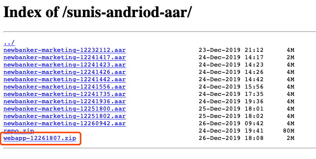
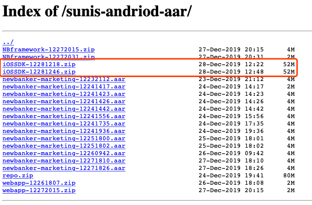
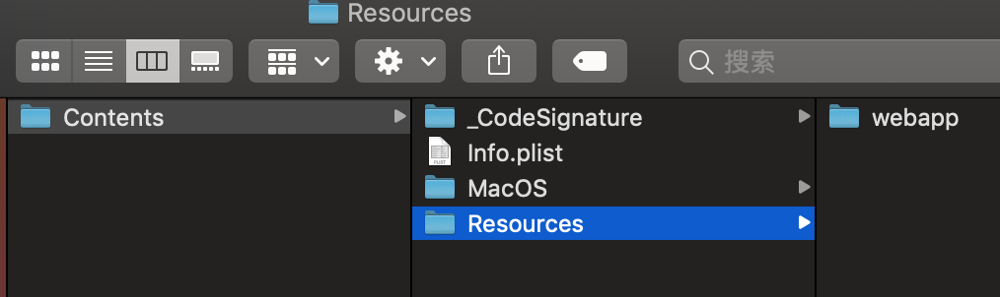

# marketing mobile sdk demo

营销解决方案

## 移动端Demo

### Android Demo使用说明

##### 1. 运行
demo地址: https://github.com/NewBanker/marketing-mobile-sdk-demo/

AndroidStudio导入工程的android目录

##### 2. 更新aar
###### 1. 下载newbanker-marketing.aar包，[aar包下载地址](https://log.newbanker.work/sunis-andriod-aar)
***（注意：上面放置的是以时间戳结尾的aar文件，下载最新的aar文件后手动改成newbanker-marketing.aar再集成到工程）***
###### 2. 将下载好的newbanker-marketing.aar文件替换android/app/libs目录下的原aar文件
###### 3. 清空之前的aar缓存，参考Andrid常见问题。

### iOS Demo使用说明

##### 1.下载demo工程

下载本demo工程到本地。

##### 2.下载 `webapp` 资源文件

从 [地址](https://log.newbanker.work/sunis-andriod-aar/)  下载 `webapp` 资源文件并解压。



##### 3.拷贝 `webapp` 资源文件

在demo工程中找到 `NBFrameworkBundle.bundle` ，右键  `显示包内容` ，然后将第二步下载的资源文件拷贝到 `Contents/Resources` 目录下。




##### 4.运行demo工程

打开iOS项目运行。

## 常见问题

### iOS常见问题

### Android常见问题

##### 1.aar缓存问题
如果之前集成过一遍aar包，需要清空之前的aar缓存。
在工程根目录下执行以下命令：
```
rm -rf android/.idea/cache/
rm -rf android/.idea/libraries/
```
然后重新Sync Android工程
##### 2.AndroidStudio版本兼容问题
***注意demo工程是在AndroidStudio 3.5.3创建的，如果demo工程无法正常打开，考虑升级AS***
